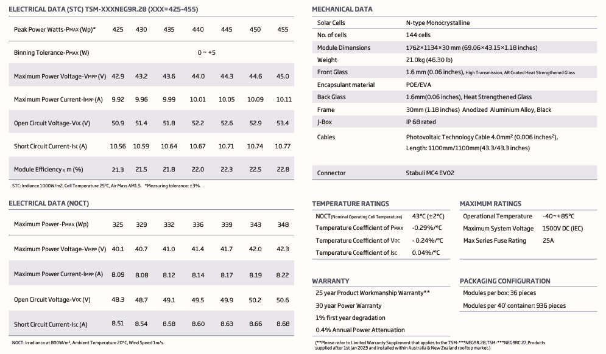

تُمثل ورقة البيانات (**Datasheet**) الوثيقة المرجعية الشاملة التي تُلخص كافة الخصائص التقنية، والميكانيكية، والكهربائية للوح الشمسي، وهي الأداة الأساسية للمهندس والفني لتصميم المنظومة واختيار المكونات المتوافقة. يحتوي الجزء الأول من "الداتا شيت" غالباً على **الميزات المفتاحية والشهادات**، وهي أجزاء تجمع بين الجانب التقني والجانب التسويقي لإثبات جودة المنتج وموثوقيته.

### **الشهادات والاعتمادات الدولية (Certifications)**

---

تُعد الشهادات مؤشراً حاسماً على أن اللوح قد اجتاز اختبارات قاسية في مختبرات عالمية (مثل مختبرات **TUV** الألمانية) لضمان مطابقته للمعايير الدولية. وأهم هذه الشهادات:

- **الرمز IEC 61215:** يعبر عن شهادة **الجودة والأداء**؛ حيث تضمن أن اللوح قادر على العمل في الظروف الخارجية لفترات طويلة وأن استطاعته المُعلنة مطابقة للواقع.
- **الرمز IEC 61730:** يعبر شهادة **السلامة والأمان**؛ وتؤكد أن اللوح مصمم بطريقة تمنع حدوث الصدمات الكهربائية أو الحرائق، وتضمن جودة العزل الكهربائي.
- **شهادات ISO (9001, 14001, 45001):** لا تتعلق باللوح ذاته بل بـ **المصنع**، حيث تؤكد اتباع الشركة لأنظمة إدارة الجودة، وحماية البيئة، والسلامة والصحة المهنية في عمليات التصنيع.
- **علامة CE:** تشير إلى مطابقة المنتج للمعايير الأوروبية المتعلقة بالصحة والسلامة وحماية البيئة.

![[PV-04-26.jpg]]

### **الميزات المفتاحية (Key Features)**

---

يهدف هذا الجزء لاستعراض نقاط القوة التقنية التي ترفع من كفاءة وعمر اللوح:

- **تعدد الباسبار (Multi Busbar - MBB):** يشير وجود عدد كبير من الباسبارات (مثل **9BB** في العينة المرفقة) إلى تحسين قدرة تجميع التيار وتقليل المفقودات الناتجة عن المقاومة الداخلية، كما يساهم في خفض حرارة اللوح وتوزيع الجهد بشكل أفضل عبر الخلايا.
- **مقاومة التدهور الناتج عن الجهد المستحث (PID Resistant):** تضمن هذه الميزة قدرة اللوح على الصمود أمام ظاهرة الـ (PID) التي تسبب فقداً في القدرة بمرور الوقت نتيجة فرق الجهد العالي بين الخلايا والإطار، خاصة في البيئات ذات الرطوبة والحرارة العالية.
- **مقاومة التشققات (Anti-Crack):** تشير إلى متانة الخلايا وقدرتها على تحمل الإجهادات الميكانيكية التي قد تسبب تشققات دقيقة (Micro-cracks) غير مرئية تؤدي لاحقاً لتعطل الخلية.
- **الأداء في الإضاءة المنخفضة (Low-Light Performance):** تقنية تسمح للوح بإنتاج طاقة فعالة حتى في ظروف الإشعاع الضعيف، مثل أوقات الصباح الباكر، الغروب، أو في الأيام الغائمة.
- **القوة الميكانيكية (Strength and Durability):** يتم اختبار اللوح لتحمل ضغوط ميكانيكية كبيرة، وتُصنف عالمياً بـ **5400 باسكال** لتحمل تراكم الثلوج (Snow load)، و **2400 باسكال** لتحمل ضغط الرياح العاتية (Wind load).

### **الضمانات (Warranties)**

تفرق الشركات المصنعة بين نوعين من الضمان لضمان استثمار العميل:

1. **ضمان المنتج (Product Warranty):** يغطي عيوب الصناعة في المواد والهيكل (مثل الإطار أو صندوق التوصيل)، ومدته في العينة المرفقة **12 سنة**.
2. **ضمان الأداء الخطي (Linear Performance Warranty):** هو ضمان على إنتاجية اللوح بمرور الزمن؛ حيث تضمن الشركة أن اللوح لن يفقد أكثر من نسبة مئوية معينة سنوياً (غالباً 1% أو أقل)، بحيث يظل ينتج ما لا يقل عن **80% إلى 84.8%** من قدرته الاسمية بعد مرور **25 إلى 30 سنة**.

### **التسامح في الاستطاعة (Power Tolerance)**

تذكر الشركات قيمة مثل (**0~+5W**) أو (**3%+**)، وهذا يعني أن اللوح إذا كانت قدرته 385 واط، فإنه مضمون أن ينتج **على الأقل** 385 واط أو أكثر بنسبة بسيطة (تصل لـ 390 واط مثلاً)، ولا يمكن أن يخرج من المصنع بقدرة أقل من القيمة المكتوبة، وهو ما يسمى بـ **التسامح الموجب**.

أما بالنسبة **للجزء الثاني** من ورقة البيانات (**Datasheet**) فيستعرض الجوانب التقنية البحتة للوح الشمسي، حيث يتم تفصيل الخصائص الكهربائية والميكانيكية التي يعتمد عليها المهندسون في تصميم وحسابات المنظومة. يهدف هذا الجزء إلى توفير بيانات دقيقة حول أداء اللوح في ظروف اختبار مختلفة، وكيفية استجابته للعوامل البيئية مثل الحرارة والإشعاع.

### **الخصائص الكهربائية (Electrical Data)**

يتم قياس هذه الخصائص عادةً تحت معيارين مختلفين لتوضيح الفارق بين الأداء المثالي والواقعي:

1. **ظروف الاختبار القياسية (STC):** وتتم عند إشعاع $1000 W/m^2$، ودرجة حرارة خلية $25^\circ C$، وكتلة هواء $AM 1.5$. وتشمل القيم الرئيسية المذكورة تحت هذا المعيار:
- **الاستطاعة القصوى ($P_{max}$):** هي الاستطاعة الاسمية للوح (مثل 440 واط في عينة الداتاشيت)، وتُمثل أقصى قدرة يمكن استخلاصها من اللوح عند توفر الظروف المثالية.
- **تسامح الاستطاعة (Binning Tolerance):** ميزة تقنية تضمن أن اللوح المنتج لن تقل قدرته الفعلية عن القيمة الاسمية المكتوبة؛ حيث يُشار إليها بـ ($0 \sim +5W$)، مما يعني أن اللوح قد يُنتج استطاعة تصل إلى 445 واط، لكنه لن يقل أبداً عن 440 واط، وهو ما يسمى بـ "التسامح الموجب".
- **جهد الدارة المفتوحة ($V_{oc}$):** هو أقصى جهد يخرجه اللوح عندما تكون أطرافه غير متصلة بأي حمل كهربائي (تيار صفر)، ويُستخدم هذا الرقم بشكل أساسي لتحديد أقصى جهد للمنظومة لضمان عدم تلف العاكس.
- **تيار القصر ($I_{sc}$):** يُمثل أقصى تيار يتدفق من اللوح عند توصيل طرفيه الموجب والسالب معاً (جهد صفر). وتكمن أهميته في حساب سعة الفيوزات والقواطع وتحديد أقطار الكابلات لضمان تحملها للتيار في حالات الخلل.
- **الجهد والتيار عند أقصى قدرة ($V_{mp}$ & $I_{mp}$):** وهما قيم التشغيل الفعلية عندما يتم ربط اللوح بالمنظومة (العاكس أو الشاحن)، حيث يكون الجهد أقل قليلاً من $V_{oc}$ والتيار أقل من $I_{sc}$ لضمان الحصول على أعلى استطاعة.
- **الكفاءة ($\eta$):** النسبة المئوية لتحويل الإشعاع الساقط على مساحة اللوح إلى طاقة كهربائية، وتتراوح غالباً بين 15% إلى 20% في التقنيات التجارية.
1. **درجة حرارة تشغيل الخلية الاسمية (NOCT):** تحاكي هذه الظروف بيئة العمل الحقيقية ($800 W/m^2$ إشعاع، و $20^\circ C$ حرارة الجو المحيط، وسرعة رياح $1 m/s$). وتكون قيم الاستطاعة والجهد والتيار في هذا الجدول دائماً أقل من قيم الـ STC، مما يوفر للمصمم رؤية أكثر واقعية لإنتاجية المحطة.

### **المعاملات الحرارية (Temperature Rating)**

تعد هذه المعاملات بالغة الأهمية لأنها تصف مدى تأثر أداء اللوح بارتفاع درجة الحرارة فوق $25^\circ C$:

- **معامل القدرة والجهد:** تكون قيمهما بالسالب، مما يعني أن استطاعة اللوح وجهده ينخفضان مع كل درجة حرارة إضافية، وهو ما يفسر تراجع الأداء في المناطق الحارة.
- **معامل التيار:** تكون قيمته موجبة ولكنها صغيرة جداً، مما يشير إلى زيادة طفيفة في التيار مع ارتفاع الحرارة، إلا أن محصلة القدرة النهائية تظل في انخفاض.

### **حدود التشغيل والحماية (Maximum Ratings)**

يحدد هذا الجزء الحدود الآمنة التي لا يجوز تجاوزها لضمان سلامة المعدات:

- **أقصى جهد للمنظومة (Maximum System Voltage):** يحدد أقصى جهد إجمالي مسموح به عند ربط الألواح على التوالي (غالباً $1000V$ أو $1500V$)، وهو ما يحدد عدد الألواح في السلسلة الواحدة.
- **أقصى تيار للفيوز (Maximum Series Fuse Rating):** تُحدد قيمة الفيوز اللازم لوضعه في صندوق التجميع لحماية السلسلة من التيارات العكسية التي قد تتدفق من السلاسل المتوازية الأخرى في حال حدوث تظليل أو عطل، وغالباً ما تتراوح بين $15A$ إلى $25A$.

### **الخصائص الميكانيكية (Mechanical Characteristics)**

تتعلق بالبناء الفيزيائي للوح وتشمل:

- **نوع وعدد الخلايا:** مثل "72 خلية بولي كريستالين" أو "120 خلية مونو مقصوصة"، بالإضافة إلى أبعاد الخلية الواحدة.
- **الأبعاد والوزن:** طول وعرض وسمك الإطار ووزن اللوح الإجمالي، وهي معلومات ضرورية لتصميم الهياكل المعدنية وحساب أحمال الرياح.
- **معامل الحماية IP (Ingress Protection) :** يُشير إلى المعيار العالمي المستخدم لتقييم درجة حماية الأغلفة الكهربائية، مثل صندوق التوصيل (Junction Box) الموجود بظهر اللوح الشمسي، ضد نفاذ الأجسام الصلبة والسوائل، ا**لرقم الأول (6)** يختص بالحماية من الأجسام الصلبة، والرقم (6) هو أعلى درجة في هذا التصنيف، ويعني أن الصندوق **محكم تماماً ضد الغبار**، **الرقم الثاني (7 أو 8)** يختص بالحماية من السوائل والمياه، حيث الرقم (7) تضمن حماية المكونت الداخلية من الغمر المؤقت في الماء، أي ما يوفر حماية مناسبة ضد الأمطار والسيول. أما الرقم (8) يمثل مستوى حماية أعلى وأكثر احترافية، ويضمن الحماية من الغمر المستمر في الماء تحت ظروف وضغوط أكثر قسوة يحددها المصنع.
- **الكابلات:** طول ونوع كابلات التوصيل (عادةً $4mm^2$) ونوع الموصلات المستخدمة (MC4).